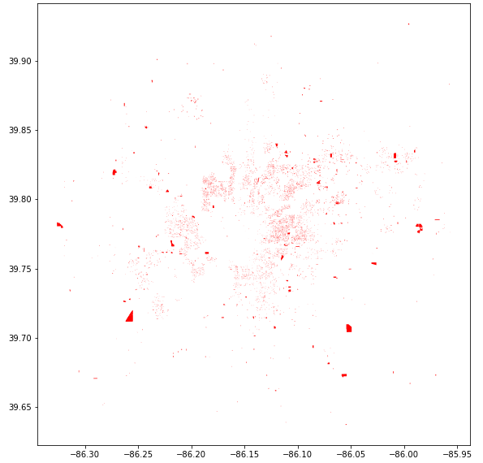
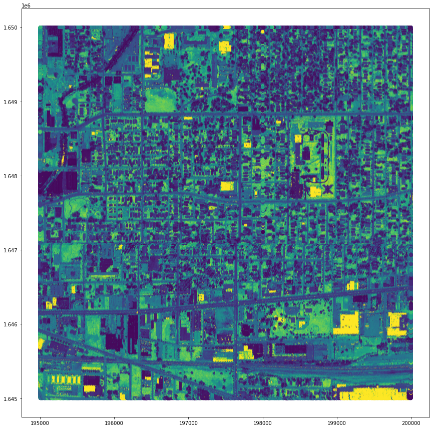
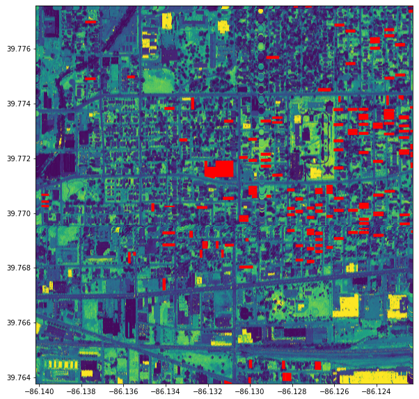

# Abandoned Building Classifier

**Purpose:** Swiftly and automatically identify abandoned buildings.

**Impact:** Minimize time and cost of finding and confirming vacant and abandoned buildings.

**Problem Statement:** Abandoned and vacant buildings are traditionally identified through a tedious and inefficient process of manual, on-the-ground identification. Modern approaches evaluate a building's likelihood of occupancy through utility data -- whether the building has running water; whether it has an active account with a gas utility; etc. These modern approaches use machine learning by training a predictive model on existing utility and building vacancy data. To date, I have found no attempt to identify vacant and abandoned buildings through a visual machine learning approach.  

I will attempt to train a binary classification model that intakes LiDAR imagery of Indianapolis, IN and classifies a building as either occupied or vacant. This is a preliminary step to see if this approach yields promising results for further development. Given my limited time, limited access to data, and limited expertise in this field, I set my threshold for a potentially useful approach at a model accuracy of +10% above the baseline model, and a sensitivity of +10% above the baseline model. If these goals are satisfied, I recommend training a more general model on cities accross the United States that will achieve this goal for any urban area in the country.  

---

**Data:**  
Vacant or abandoned buildings  
1. Abandoned and Vacant housing in Indianapolis
    * [Link to dataset](https://data.indy.gov/datasets/abandoned-and-vacant-housing/data?geometry=-86.313%2C39.748%2C-85.983%2C39.794)
    * 7,219 labeled vacant or abandoned buildings
    * Current up to 01/21/2021

2. LiDAR Satelite basemap
    * [Link to dataset](https://lidar.jinha.org/download.php?cname=marion&clon=-86.13305839196093&clat=39.779844384833936&years=2011,2016)
    * [Link to metadata](https://www.dropbox.com/sh/ft35dwy9m5qe9f1/AACXW_W_DoWDiHeOUh00tAzja/2016%20Marion%20County?dl=0&subfolder_nav_tracking=1)
    

Combining the two datasets above, yields:

