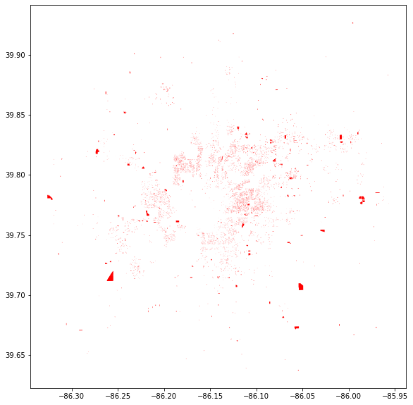
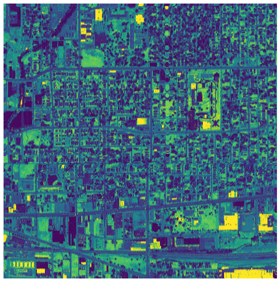
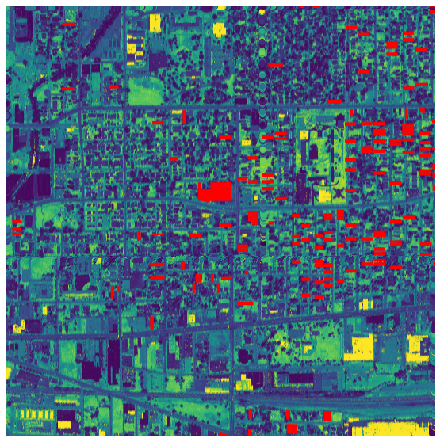

# Abandoned Building Classifier

**Purpose:** Swiftly and automatically identify abandoned buildings.

**Impact:** Minimize time and cost of finding and confirming vacant and abandoned buildings.

**Problem Statement:** Abandoned and vacant buildings are traditionally identified through a tedious and inefficient process of manual, on-the-ground identification. Modern approaches evaluate a building's likelihood of occupancy through utility data -- whether the building has running water; whether it has an active account with a gas utility; etc. These modern approaches use machine learning by training a predictive model on existing utility and building vacancy data. To date, I have found no attempt to identify vacant and abandoned buildings through a visual machine learning approach.  

I will attempt to train a binary classification model that intakes LiDAR imagery of Indianapolis, IN and classifies a building as either occupied or vacant. This is a preliminary step to see if this approach yields promising results for further development. Given my limited time, limited access to data, and limited expertise in this field, I set my threshold for a potentially useful approach at a model that improves on the baseline accuracy and sensitivity by any amount. If these goals are satisfied, I recommend training a more general model on cities accross the United States that will achieve this goal for any urban area in the country.  

**Results:** All three models failed to beat the baseline accuracy. Additionally, the sensitivity scores for all three models is 0.0.  
|          | Accuracy % | Sensitivity % | Accuracy % Change |
|----------|-----------:|--------------:|------------------:|
| baseline |      98.42 |           --- |          0.000000 |
|  k-means |      98.29 |           0.0 |         -0.001385 |
|      MLP |      97.81 |           0.0 |         -0.006275 |
|      SVC |      97.81 |           0.0 |         -0.006216 |

---

**Data:**  
Vacant or abandoned buildings  
1. Abandoned and Vacant housing in Indianapolis
    * [Link to dataset](https://data.indy.gov/datasets/abandoned-and-vacant-housing/data?geometry=-86.313%2C39.748%2C-85.983%2C39.794)
    * 7,219 labeled vacant or abandoned buildings
    * Current up to 01/21/2021

2. LiDAR Satelite basemap
    * These data files are too large to upload to GitHub, and so have been removed from this repo. You may find this data at the link below.
    * [Link to dataset](https://lidar.jinha.org/download.php?cname=marion&clon=-86.13305839196093&clat=39.779844384833936&years=2011,2016)
    * [Link to metadata](https://www.dropbox.com/sh/ft35dwy9m5qe9f1/AACXW_W_DoWDiHeOUh00tAzja/2016%20Marion%20County?dl=0&subfolder_nav_tracking=1)
    

Combining the two datasets above, yields:

---

**Modeling:**  
The baseline accuracy, which I aim to beat, is *0.9842* for the testing image.  

*Training* Scores:  
|          | Accuracy % | Sensitivity % | Accuracy % Change |
|----------|------------|---------------|-------------------|
| baseline |      97.81 |           --- |               0.0 |
|  k-means |      93.97 |        4.7479 |           -0.0393 |
|      MLP |      97.81 |           0.0 |               0.0 |
|      SVC |      97.81 |        0.2629 |            0.0001 |

*Testing* Scores:  
|          | Accuracy % | Sensitivity % | Accuracy % Change |
|----------|-----------:|--------------:|------------------:|
| baseline |      98.42 |           --- |          0.000000 |
|  k-means |      98.29 |           0.0 |         -0.001385 |
|      MLP |      97.81 |           0.0 |         -0.006275 |
|      SVC |      97.81 |           0.0 |         -0.006216 |

The models were all trained on a single image of 294,848 pixels (the satellite basemap image shown above) and tested on a separate image which also encompasses 294,848 pixels. Both images are from neighboring areas spanning the Arsenal Heights and Woodruff Place neighborhoods in Indianapolis.

Of the three models trained, the unsupervised model, k-means, outperformed the two supervised learning models, MLP and SVC.

---

**Recommendations:**  
Based on the failure of all three models to improve on the baseline accuracy, paired with the extremely low sensitivity scores on both training and testing images, I recommend this project be discontinued, or altered drastically. I believe the failure of these models is due largely to two factors: 1) LiDAR sensor data is a poor choice for the input image, and 2) Any differences in vacant and occupied buildings from an eagle-eye's view are slight, except for in cases of extreme damage.  

There are several promising options available to alter and further develop this project. I will list them below.  
1) Use satellite images in place of LiDAR sensor data.  
2) Decrease the tile size, focusing particularly on buildings that are abandoned, so that the baseline accuracy will be lower.  
3) Incorporate a two-fold ensemble model. One model predicts whether a parcel of land is abandoned from satellite imagery, while the other model predicts based off of Google Street View images from outside the residence.  